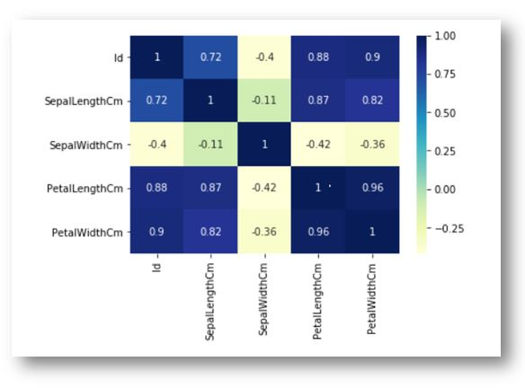
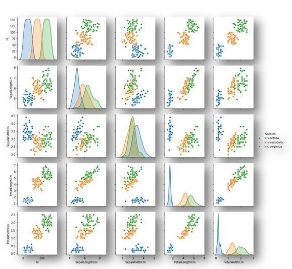
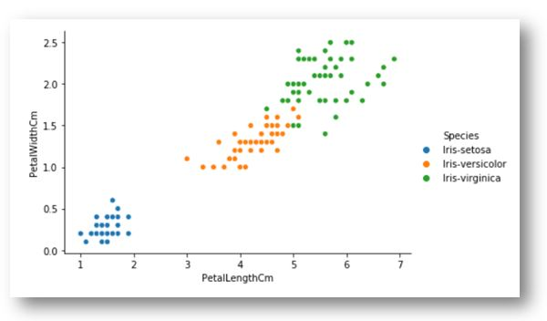
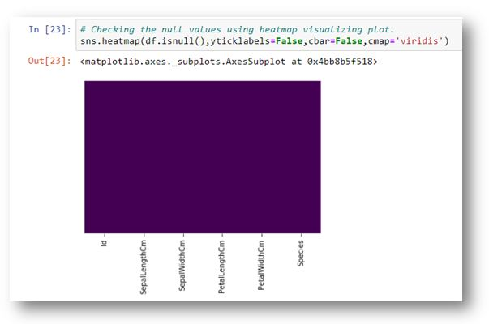
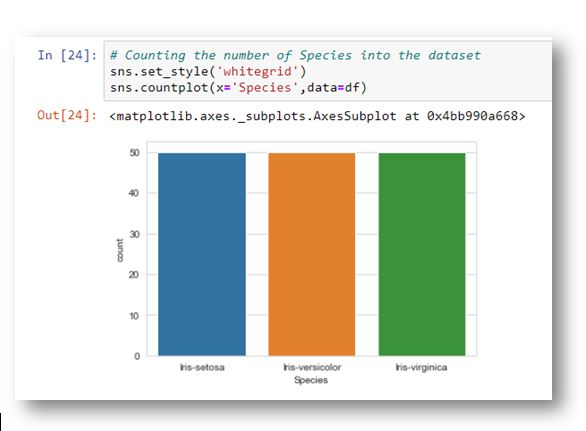

# Iris Flower Classification #
## Table of Content ##
- [Overview](#overview) 
- [Motivation](#motivation) 
- [Installation](#installation) 
- [About the Data](#about-the-data) 
- [Directory Tree Structure](#directory-tree-structure) 
- [Technologies Used](#technologies-used) 
- [Packages Used](#packages-used)
- [Data Collection](#data-collection)
- [Data Cleaning](#data-cleaning) 
- [Exploratory Data Analysis](#exploratory-data-analysis) 
- [Model Fitting](#model-fitting) 
- [Accuracy and Prediction Score](#accuracy-and-prediction-score)
- [Deployment](#deployment)  
- [Team](#team) 

## Overview 
This is a simple **Classification** project where we can able to do the classifying the **Iris flowers**. 
Create the Machine Learning model that can classify the different species of the Iris flower.

## Motivation 
What could be a perfect way to utilize unfortunate lockdown period? Like most of you, I spend my time Gardening, Games, Movies, Coding and read some stories as well as read some of the trending AI Papers through the Google. When i heard about the Iris Flowers Classification i could find my own interset to making this model. So i retrive the dataset form kaggle and making this idea come true.

## Installation 
The Code is written in Python 3.7. If you don't have Python installed just [clik here](https://www.python.org/downloads/) and install python on your system. 
If you are using a lower version of Python you can upgrade using the pip package, ensuring you have the latest version of pip. To install the required packages and libraries, such as numpy, pandas, matplotlib and sklearn.

## About the Data 
The Iris flower data set or Fisher's Iris data set is a multivariate data set introduced by the British statistician, eugenicist, and biologist Ronald Fisher in his 1936 paper the use of multiple measurements in taxonomic problems as an exampleof linear discriminant analysis.His contribution to statistics is way beyond the Fisher's exact test. For example, he developedthe maximum likelihood estimation and the analysis of variance (more commonly known as its acronym ANOVA) test.If you wanna get this data set just [click here](https://www.kaggle.com/arshid/iris-flower-dataset) and you will get it. For these important contributions, he has been highly regarded in the history of modern statistics, as noted on his Wikipedia page.


** This is Ronald Fisher If you Wanna know more about him** Just [click here](https://en.wikipedia.org/wiki/Ronald_Fisher)

## **This can be Explain about the Iris Flower Data Measurements** ##


## Directory Tree Structure 

## Technologies Used 

  

## Packages Used 

          

    
  
  

## Data Collection 

* I got the dataset from Kaggle if you wanaa get it [click here](https://www.kaggle.com/arshid/iris-flower-dataset).
* This dataset consists of 3 categories of species which is setosa, versicolor and virginica.
* We can find two kind of data from kaggle which is CSV data and SQLITE database.
* Each iris species consists of 50 samples.
* The features of iris flower are Sepal Length in cm, Sepal Width in cm, Petal Length in cm and Petal Width in cm.
* In this Iris dataset in avilable on **[sklearn](https://scikit-learn.org/stable/auto_examples/datasets/plot_iris_dataset.html)** library.
### The following code can help to get the Iris dataset from sklearn 

```python
# TODO : Load Iris Dataset

# Load iris Dataset from sklearn
from sklearn import datasets
iris = datasets.load_iris()

# Load Iris csv dataset
iris_csv = pd.read_csv('../data/Iris.csv')

# Load Iris sqlite data
data = sqlite3.connect('../data/database.sqlite')
query = data.execute('SELECT * FROM Iris')
columns = [col[0] for col in query.description]
iris_db = pd.DataFrame.from_records(data = query.fetchall(), columns = columns)
```

## Data Cleaning 

We need not to cleaning the data for making the machine learning model. Because we were retrive the data from kaggle and sklearn, is already have the format of csv(Comma Separated File) It's already getting clean data. So We don't put the stuffs for data cleaning. If you wanna more about the Art of Data Cleaning Process in Machine Learning 
just [Click Here](https://towardsdatascience.com/the-art-of-cleaning-your-data-b713dbd49726).

## Exploratory Data Analysis 

In statistics, exploratory data analysis (EDA) is an approach to analyzing data sets to summarize their main characteristics, often with visual methods.A statistical model can be used or not, but primarily EDA is for seeing what the data can tell us beyond the formal modeling or hypothesis testing task. Here we performed some of the EDA Process to help the audience for visualize the Iris Flower data.

#### Letz Understand the correlation concepts between the data features using heatmap
```python
# TODO : Correlation between the data features
cor = df.drop("Species", axis=1).corr()
sns.heatmap(data=cor,annot = True,cmap="YlGnBu")
```


#### Next we would Understand the data features in Species Column using pairplot
```python
# TODO : Species data features
sns.pairplot(df,hue='Species')
```


#### Let's understand how the Petal length and Petal width contributes together to classify iris species.
```python
# TODO : Sepal and Petal data features
sns.relplot(x = 'PetalLengthCm', y = 'PetalWidthCm', data = df, hue = 'Species', aspect =1.5, height = 4)
```



#### Let's understand how the null values are already cleared and also visualize using the heatmap
```python
# TODO : Checking the null values into the data features
sns.heatmap(df.isnull(),yticklabels=False,cbar=False,cmap='viridis')
```


**There is no null values into the dataset 

#### Here we count the each speices values using Boxplot
```python
# TODO : Checking the number of the each species values into the Iris dataset
sns.set_style('whitegrid')
sns.countplot(x='Species',data=df)
```


## Model Fitting 
``` python
TODO: Assigning the values for model fitting
X = df.iloc[:,[1,2,3,4]]
y = df.iloc[:,[-1]]

```
```python
# TODO: Train Test Split and Build and Train the model

Since our process involves training and testing, we should split our dataset. It can be executed by the following code.

from sklearn.model_selection import train_test_split
X_train,X_test,y_train,y_test = train_test_split(X,y,test_size=0.3,random_state=0)
```
``` python
TODO: Using SVM Classifier

from sklearn.svm import SVC

svm = SVC()

svm.fit(X_train,y_train)

```
``` python
TODO: Prediciting
pred = svm.predict(X_test)
```

## Accuracy and Prediction Score 

#### Using Confusion Matrix for Classification prediction

``` python
from sklearn.metrics import classification_report,confusion_matrix
print(confusion_matrix(y_test,pred))
```
#### Confusion Matrix Result
``` python 
[[16  0  0]
 [ 0 17  1]
 [ 0  0 11]]
 
 ```
 #### Using Classification Reports for prediction 
 
 ``` python
 print(classification_report(y_test,pred))
 ```
 
 #### Classification Report Results
 ``` python
                  precision    recall  f1-score   support

    Iris-setosa       1.00      1.00      1.00        16
Iris-versicolor       1.00      0.94      0.97        18
 Iris-virginica       0.92      1.00      0.96        11

       accuracy                           0.98        45
      macro avg       0.97      0.98      0.98        45
   weighted avg       0.98      0.98      0.98        45

```
#### Making Sample Prediction

``` python
svm.predict([[5.3,3.4,2.7,3.9]])
```

#### Output for Sample Prediction

``` python
array(['Iris-virginica'], dtype=object)
```

### Prediction Score

``` python
print("Accuracy Score:",svm.score(X_test,y_test) * 100)
```
### Accuracy Score: 97.77777777777777

## Deployment 

## Team


