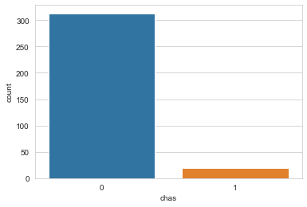

<p align = "center"><h1><b> HOUSE PRICE PREDCTION USING MACHINE LEARNING ALGORITHM </b></h1> </p> </br>

[](https://medium.com/@Nivitus./boston-house-price-prediction-using-machine-learning-ad3750a866cd)

## Table of Content ##

- [Overview](#overview)
- [Motivation](#motivation)
- [Understand the Problem Statement](#understand-the-problem-statement)
- [About the Dataset](#about-the-dataset)
- [About the Algorithms used in this Project](#about-the-algorithms-used-in-this-project)
- [Directory Tree Structure](#directory-tree-structure) 
- [Technologies Used](#technologies-used) 
- [Packages Used](#packages-used)
- [Data Collections](#data-collections)
- [Data Preprocessing](#data-preprocessing)
- [Exploratory Data Analysis](#exploratory-data-analysis)
- [Feature Observation](#feature-observation)
- [Feature Selection](#feature-selection)
- [Model Building](#model-building)
- [Model Performances](#model-performances)
- [Prediction and Final Score](#prediction-and-final-score)
- [Deployment](#deployment)
- [Team](#team)
- [Conclusion](#conclusion)

## Overview

So far so good, today we are going to work on a dataset which consists information about the location of the house, price and other aspects such as square feet etc. When we work on these sorts of data, we need to see which column is important for us and which is not. Our main aim today is to make a model which can give us a good prediction on the price of the house based on other variables. We are going to use Linear Regression for this dataset and see if it gives us a good accuracy or not.

In this Blog we are going to do implementing a salable model for predicting the house price prediction using some of the regression techniques based of some of features in the dataset which is called Boston House Price Prediction. There are some of the processing techniques for creating a model. We will see about it in upcoming parts …

## Motivation

The Motivation behind it I just wanna know about the house prices in California as well as I’ve an idea about to do some of the useful things do in the lock down period. I think this is a limited motivation for doing this blog well.

## Understand the Problem Statement


Housing prices are an important reflection of the economy, and housing price ranges are of great interest for both buyers and sellers. Ask a home buyer to describe their dream house, and they probably won’t begin with the height of the basement ceiling or the proximity to an east-west railroad. But this playground competition’s data-set proves that much more influences price negotiations than the number of bedrooms or a white-picket fence.

## About the Dataset

Housing prices are an important reflection of the economy, and housing price ranges are of great interest for both buyers and sellers. In this project, house prices will be predicted given explanatory variables that cover many aspects of residential houses. The goal of this project is to create a regression model that is able to accurately estimate the price of the house given the features.
In this dataset made for predicting the Boston House Price Prediction. Here I just show the all of the feature for each house separately. Such as Number of Rooms, Crime rate of the House’s Area and so on. We’ll show in the upcoming part.

### Data Overview


``` python
1. CRIM per capital crime rate by town
2. ZN proportion of residential land zoned for lots over 25,000 sq.ft.
3. INDUS proportion of non-retail business acres per town
4. CHAS Charles River dummy variable (= 1 if tract bounds river; 0 otherwise)
5. NOX nitric oxides concentration (parts per 10 million)
6. RM average number of rooms per dwelling
7. AGE proportion of owner-occupied units built prior to 1940
8. DIS weighted distances to five Boston employment centers
9. RAD index of accessibility to radial highways
10.TAX full-value property-tax rate per 10,000 USD
11.PTRATIO pupil-teacher ratio by town
12.Black 1000(Bk — 0.63)² where Bk is the proportion of blacks by town
13.LSTAT % lower status of the population
```
## About the Algorithms used in this Project

The major aim of in this project is to predict the house prices based on the features using some of the regression techniques and algorithms.

### 1. Linear Regression
### 2. Random Forest Regressor

## Directory Tree Structure

## Technologies Used

[](https://www.python.org/)

## Packages Used

[](https://numpy.org/doc/)  [](https://pandas.pydata.org/)    

[](https://seaborn.pydata.org/)  [](https://matplotlib.org/)
  
[](https://scikit-learn.org/stable/)

## Data Collections

I got the Dataset from [Kaggle](https://www.kaggle.com/prasadperera/the-boston-housing-dataset). This Dataset consist several features such as Number of Rooms, Crime Rate, and Tax and so on. Let’s know about how to read the dataset into the Jupyter Notebook. You can download the dataset from Kaggle in csv file format.Yup! you wanna get dataset from kaggle just [click here](https://www.kaggle.com/prasadperera/the-boston-housing-dataset)

As well we can also able to get the dataset from the sklearn datasets. Yup! It’s available into the sklearn Dataset just [click here](https://scikit-learn.org/stable/modules/generated/sklearn.datasets.load_boston.html) and get it

### Let’s we see how can we retrieve the dataset from the sklearn dataset.

``` python
from sklearn.datasets import load_boston
X, y = load_boston(return_X_y=True)
```

### Code for collecting data from CSV file into Jupyter Notebook!

``` python
# Import libraries
import numpy as np
import pandas as pd
# Import the dataset
df = pd.read_csv(“train.csv”)
df.head()
```


## Data Preprocessing

In this Boston Dataset we need not to clean the data. The dataset already cleaned when we download from the Kaggle. For your satisfaction i will show to number of null or missing values in the dataset. As well as we need to understand shape of the dataset.

``` python
# Shape of dataset
print(“Shape of Training dataset:”, df.shape)
Shape of Training dataset: (333, 15)
# Checking null values for training dataset
df.isnull().sum()
```
``` python
ID         0
crim       0
zn         0
indus      0
chas       0
nox        0
rm         0
age        0
dis        0
rad        0
tax        0
ptratio    0
black      0
lstat      0
medv       0
dtype: int64
```
Note: The target variable is the last one which is called medv. So we can’t able to get confusion so I just rename the feature name medv into Price.

``` python
# Here lets change ‘medv’ column name to ‘Price’
df.rename(columns={‘medv’:’Price’},inplace=True)
```
#### Yup! Look that the feature or column name is changed!


## Exploratory Data Analysis

In statistics, exploratory data analysis (EDA) is an approach to analyzing data sets to summarize their main characteristics, often with visual methods. A statistical model can be used or not, but primarily EDA is for seeing what the data can tell us beyond the formal modeling or hypothesis testing task.

``` python 
# Information about the dataset features
df.info()
```

``` python
<class 'pandas.core.frame.DataFrame'>
RangeIndex: 333 entries, 0 to 332
Data columns (total 15 columns):
ID         333 non-null int64
crim       333 non-null float64
zn         333 non-null float64
indus      333 non-null float64
chas       333 non-null int64
nox        333 non-null float64
rm         333 non-null float64
age        333 non-null float64
dis        333 non-null float64
rad        333 non-null int64
tax        333 non-null int64
ptratio    333 non-null float64
black      333 non-null float64
lstat      333 non-null float64
Price      333 non-null float64
dtypes: float64(11), int64(4)
memory usage: 39.1 KB
```

``` python
# Describe
df.describe()
```


## Feature Observation

``` python
# Finding out the correlation between the features
corr = df.corr()
corr.shape
```

### First Understanding the correlation of features between target and other features

``` python
# Plotting the heatmap of correlation between features
plt.figure(figsize=(14,14))
sns.heatmap(corr, cbar=False, square= True, fmt=’.2%’, annot=True, cmap=’Greens’)
```


``` python
# Checking the null values using heatmap
# There is any null values are occupyed here
sns.heatmap(df.isnull(),yticklabels=False,cbar=False,cmap=’viridis’)
```


### Note: There are no null or missing values here.

``` python
sns.set_style(‘whitegrid’)
sns.countplot(x=’rad’,data=df)
```


``` python
sns.set_style(‘whitegrid’)
sns.countplot(x=’chas’,data=df)
```



``` python
sns.set_style(‘whitegrid’)
sns.countplot(x=’chas’,hue=’rad’,data=df,palette=’RdBu_r’)
```


``` python
sns.distplot(df[‘age’].dropna(),kde=False,color=’darkred’,bins=40)
```


``` python
sns.distplot(df[‘crim’].dropna(),kde=False,color=’darkorange’,bins=40)
```


``` python
sns.distplot(df[‘rm’].dropna(),kde=False,color=’darkblue’,bins=40)
```


## Feature Selection

Feature Selection is the process where you automatically or manually select those features which contribute most to your prediction variable or output in which you are interested in. Having irrelevant features in your data can decrease the accuracy of the models and make your model learn based on irrelevant features.

``` python
# Lets try to understand which are important feature for this dataset
from sklearn.feature_selection import SelectKBest
from sklearn.feature_selection import chi2
X = df.iloc[:,0:13] #independent columns
y = df.iloc[:,-1] #target column i.e price range
```

Note: If we want to identify the best features for the target variables. We should make sure that the target variable should be int Values. That’s why I convert into the int value from the floating point value

``` python
y = np.round(df[‘Price’])
```

``` python
#Apply SelectKBest class to extract top 5 best features
bestfeatures = SelectKBest(score_func=chi2, k=5)
fit = bestfeatures.fit(X,y)
dfscores = pd.DataFrame(fit.scores_)
dfcolumns = pd.DataFrame(X.columns)
# Concat two dataframes for better visualization
featureScores = pd.concat([dfcolumns,dfscores],axis=1)
featureScores.columns = [‘Specs’,’Score’] #naming the dataframe columns
featureScores
```

``` python
    Specs	Score
0	crim	3251.396750
1	zn	4193.279045
2	indus	618.607714
3	chas	49.220803
4	nox	3.292260
5	rm	14.620403
6	age	1659.128989
7	dis	106.642659
8	rad	879.520751
9	tax	9441.032032
10 ptratio	30.474467
11	black	2440.426651
12	lstat	972.176726
```

``` python
print(featureScores.nlargest(5,’Score’)) #print 5 best features
```

``` python
      Specs        Score
9     tax  9441.032032
1      zn  4193.279045
0    crim  3251.396750
11  black  2440.426651
6     age  1659.128989
```

### Feature Importance

``` python
import matplotlib.pyplot as plt
model = ExtraTreesClassifier()
model.fit(X,y)
```

``` python
print(model.feature_importances_) #use inbuilt class feature_importances of tree based classifiers
```

``` python
[0.10960589 0.02522698 0.04783801 0.01625897 0.07194743 0.12705093
 0.11596732 0.09949377 0.03555492 0.04813079 0.05862294 0.11718846
 0.12711358]
```

``` python
# Plot graph of feature importances for better visualization
feat_importances = pd.Series(model.feature_importances_, index=X.columns)
feat_importances.nlargest(10).plot(kind=’barh’)
plt.show()
```


## Model Building

### Linear Regression

``` python
# Values Assigning
X = df.iloc[:,0:13]
y = df.iloc[:,-1]
```

### Train Test Split

``` python
from sklearn.model_selection import train_test_split
X_train,X_test,y_train,y_test = train_test_split(X,y,test_size=0.20,random_state=0)
```

``` python
from sklearn.linear_model import LinearRegression
model = LinearRegression()
model.fit(X_train,y_train)
```

### Random Forest Regressor

``` python
# Values Assigning
X = df.iloc[:,[-1,5,10,4,9]]
y = df.iloc[:,[-1]]
```

### Train Test Split

``` python
from sklearn.model_selection import train_test_split
X_train,X_test,y_train,y_test = train_test_split(X,y,test_size=0.20,random_state=0)
```

``` python
from sklearn.ensemble import RandomForestRegressor
reg = RandomForestRegressor()
reg.fit(X_train,y_train)
```
## Model Performances

### Linear Regression

``` python
y_pred = model.predict(X_train)
```

``` python
print("Training Accuracy:",model.score(X_train,y_train)*100)
print("Testing Accuracy:",model.score(X_test,y_test)*100)
```

Training Accuracy: 72.93455672581774
Testing Accuracy: 73.12411054098592

``` python
from sklearn.metrics import mean_squared_error, r2_score
print("Model Accuracy:",r2_score(y,model.predict(X))*100)
```

Model Accuracy: 72.99823346258346

``` python
plt.scatter(y_train, y_pred)
plt.xlabel("Prices")
plt.ylabel("Predicted prices")
plt.title("Prices vs Predicted prices")
plt.show()
```


``` python
# Checking residuals
plt.scatter(y_pred,y_train-y_pred)
plt.title("Predicted vs residuals")
plt.xlabel("Predicted")
plt.ylabel("Residuals")
plt.show()
```


``` python
# Checking Normality of errors
sns.distplot(y_train-y_pred)
plt.title("Histogram of Residuals")
plt.xlabel("Residuals")
plt.ylabel("Frequency")
plt.show()
```


### Random Forest Regressor

``` python
y_pred = reg.predict(X_train)
print("Training Accuracy:",reg.score(X_train,y_train)*100)
```


## Prediction and Final Score

## Deployment

## Team

## Conclusion
