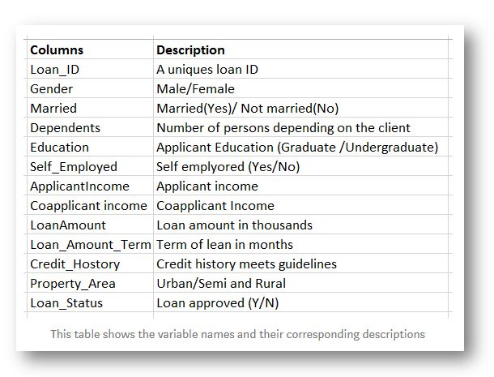
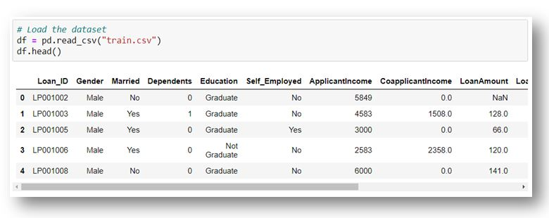
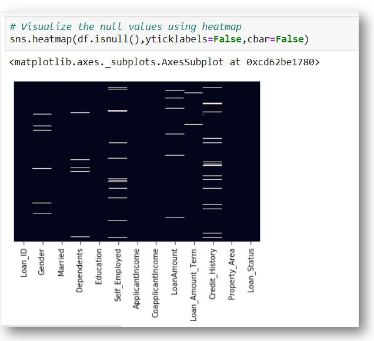
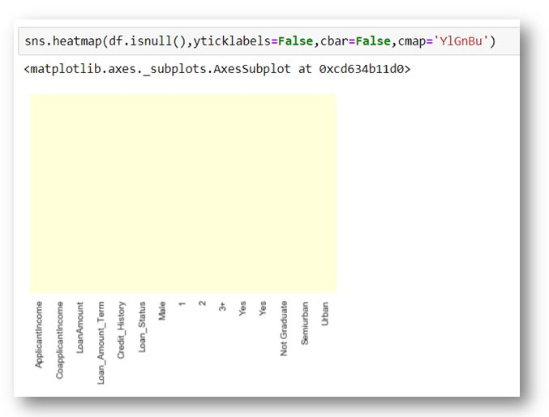
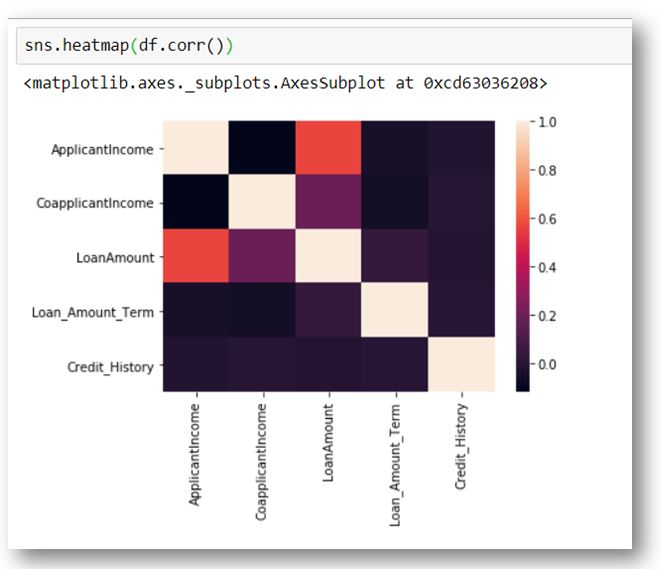
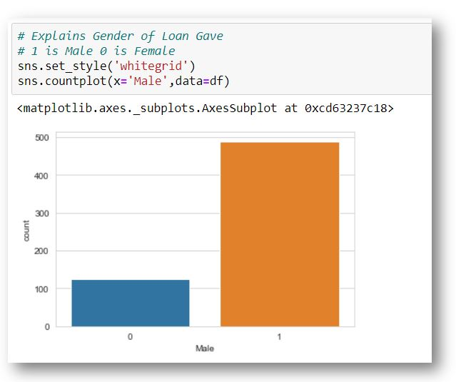
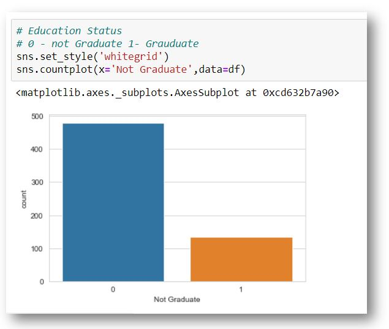
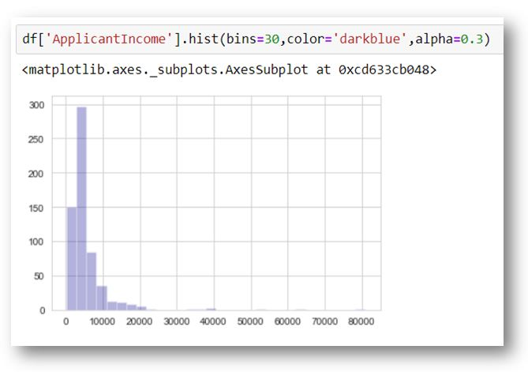
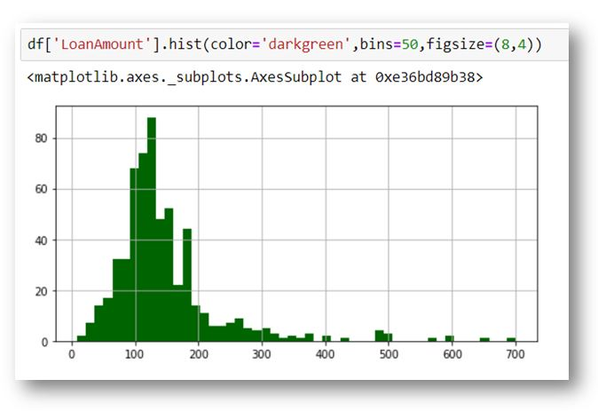

# LOAN PRICE PREDICTION USING MACHINE LEARNING #
## Table of Content ##

[](https://medium.com/@Nivitus./loan-price-prediction-using-machine-learning-b585aafa3e7)

- [Overview](#overview)
- [Motivation](#motivation)
- [About the Dataset](#about-the-dataset)
- [About the Algorithms used in this Project](#about-the-algorithms-used-in-this-project)
- [Directory Tree Structure](#directory-tree-structure) 
- [Technologies Used](#technologies-used) 
- [Packages Used](#packages-used)
- [Data Collections](#data-collections)
- [Data Preprocessing](#data-preprocessing)
- [Exploratory Data Analysis](#exploratory-data-analysis)
- [Feature Observation](#feature-observation)
- [Model Building](#model-building)
- [Model Performances](#model-performances)
- [Prediction and Final Score](#prediction-and-final-score)
- [Deployment](#deployment)
- [Team](#team)
- [Conclusion](#conclusion)


## Overview

In **finance**, a loan is the lending of money by one or more individuals, organizations, or other entities to other individuals, organizations, etc. The recipient (i.e. the borrower) incurs a debt, and is usually liable to pay interest on that debt until it is repaid, and also to repay the principal amount borrowed. To read more check out Wikipedia. The whole process of ascertaining if a burrower would pay back loans might be tedious hence the need to automate the procedure.

In this Project we are going to do implementing a scalable model for predicting a person got the eligible for getting loan or not. It’s a **Binary Classification** problem for predicting Yes or No results. There are some of the processing techniques for creating a model. We will see about it in upcoming parts

## Motivation

What could be a perfect way to utilize unfortunate lockdown period? Like most of, I spend my time Games, Movies, Coding and Writing Blogs and read about some upcoming AI articles. Now a day’s most of the people would like to apply the loan and could wish to get money from the bank for various purposes or any other personal uses. That’s what I came up with an idea about **Loan Predicting** system model.


## About the Dataset

In this Dataset made for predicting **binary classification** problem. Here all of the features represent unique client information like Loan **ID, Name, Income, and Loan Amount and so on.** We will see about it.



### Code for Checking name of the Features / Columns in the Dataset

``` python
TODO: Checking the name of the columns / Features

df.columns
```
### Output for Name of the Features /Columns in the Dataset

``` python

Index(['Loan_ID', 'Gender', 'Married', 'Dependents', 'Education',
       'Self_Employed', 'ApplicantIncome', 'CoapplicantIncome', 'LoanAmount',
       'Loan_Amount_Term', 'Credit_History', 'Property_Area', 'Loan_Status'],
      dtype='object')
```
### Let’s know more about the data features

``` python
TODO: View the data Information into the dataset
df.info()
```

``` python
<class 'pandas.core.frame.DataFrame'>
RangeIndex: 614 entries, 0 to 613
Data columns (total 13 columns):
Loan_ID              614 non-null object
Gender               601 non-null object
Married              611 non-null object
Dependents           599 non-null object
Education            614 non-null object
Self_Employed        582 non-null object
ApplicantIncome      614 non-null int64
CoapplicantIncome    614 non-null float64
LoanAmount           592 non-null float64
Loan_Amount_Term     600 non-null float64
Credit_History       564 non-null float64
Property_Area        614 non-null object
Loan_Status          614 non-null object
dtypes: float64(4), int64(1), object(8)
memory usage: 62.4+ KB
```
## About the Algorithms used in this Project

The major aim of this project is to predict which of the customers will have their loan paid or not. Therefore, this is a **supervised classification** problem to be trained with algorithms like:

**1. Logistic Regression
**2. Decision Tree
**3. Random Forest


## Directory Tree Structure


## Technologies Used

[](https://www.python.org/)

## Packages Used

[](https://numpy.org/doc/)  [](https://pandas.pydata.org/)    

[](https://seaborn.pydata.org/)  [](https://matplotlib.org/)
  
[](https://scikit-learn.org/stable/)


## Data Collections

I got the Dataset from Kaggle.If you wanna get this dataset just [Click here](https://www.kaggle.com/altruistdelhite04/loan-prediction-problem-dataset) This Dataset consist several features such as Name, Loan ID, and Loan Amount and so on. Let’s know about how to read the dataset into the Jupyter Notebook. You can download the dataset from Kaggle in csv file format.

#### Read the dataset for sample viewing

``` python
TODO: Read the Dataset using Pandas CSV format

import numpy as np
import pandas as pd

# Load the dataset
df = pd.read_csv("train.csv") 
df.head()
```

#### Display the dataset in Dataframe



## Data Preprocessing

When I download the dataset from **[Kaggle](https://www.kaggle.com/altruistdelhite04/loan-prediction-problem-dataset)** I just looked up the dataset after I understand i need to do some of the data preprocessing techniques I must to do. Here I mentioned the Techniques which are really help full for you know about the Art of Data Preprocessing and [Data Cleaning.](https://towardsdatascience.com/the-art-of-cleaning-your-data-b713dbd49726)

- [1.Handling Null / Missing Values.](https://analyticsindiamag.com/5-ways-handle-missing-values-machine-learning-datasets/)
- [2.Handling the categorical Values.](https://www.pluralsight.com/guides/handling-categorical-data-in-machine-learning-models)
- [3.Using get_dummies Method (Feature Engineering).](https://pandas.pydata.org/pandas-docs/stable/reference/api/pandas.get_dummies.html)

### Handling Null / Missing Values

Handling the missing values is one of the greatest challenges faced by analysts, because making the right decision on how to handle it.
Before that we should see on what are the features has contains the null or missing values into the dataset.

``` python
TODO: # Count the sum of the missing values in each of the features

df.isnull().sum()

Loan_ID               0
Gender               13
Married               3
Dependents           15
Education             0
Self_Employed        32
ApplicantIncome       0
CoapplicantIncome     0
LoanAmount           22
Loan_Amount_Term     14
Credit_History       50
Property_Area         0
Loan_Status           0
dtype: int64
```

### Here we can able to see the null or missing values in visual format using heatmap



#### Here I think almost six features have missing values. That’s ok, don’t panic let’s we’ll see about how to fill up the null or missing values in this dataset.

### Handling the Null / Missing Values in Numerical Values

``` python
TODO: # Using fillna methods to fillup the maean of the features

df['LoanAmount'] = df['LoanAmount'].fillna(df['LoanAmount'].mean())
df['Loan_Amount_Term'] = df['Loan_Amount_Term'].fillna(df['Loan_Amount_Term'].mean())
df['Credit_History'] = df['Credit_History'].fillna(df['Credit_History'].mean())
```

``` python
TODO: Count the sum of the missing values in each of the features
df.isnull().sum()

Loan_ID               0
Gender               13
Married               3
Dependents           15
Education             0
Self_Employed        32
ApplicantIncome       0
CoapplicantIncome     0
LoanAmount            0
Loan_Amount_Term      0
Credit_History        0
Property_Area         0
Loan_Status           0
dtype: int64
```
#### Here I used mean value for fill up the null or missing values of each feature itself.

### Handling the categorical Values

**Categorical Data** is the data that generally takes a limited number of possible values. Also, the data in the category need not be numerical; it can be textual in nature. All machine learning models are some kind of mathematical model that needs numbers to work with.

``` python
TODO: # Converting the numerical values from categorical values using get_dummies

Gender = pd.get_dummies(df['Gender'],drop_first=True)
Dependents = pd.get_dummies(df['Dependents'],drop_first=True)
Self_Employed = pd.get_dummies(df['Self_Employed'],drop_first=True)
```

Here we handling the categorical values using [get_dummies()](https://pandas.pydata.org/pandas-docs/stable/reference/api/pandas.get_dummies.html). So after fill up all the missing or null values the dataset is ready for making model. And also we handled the all of the categorical value into numerical values.

``` python
df.isnull().sum()

ApplicantIncome      0
CoapplicantIncome    0
LoanAmount           0
Loan_Amount_Term     0
Credit_History       0
Male                 0
1                    0
2                    0
3+                   0
Yes                  0
Yes                  0
Not Graduate         0
Semiurban            0
Urban                0
Loan_Status          0
dtype: int64
```
### After cleaning the all of the null or missing values the dataset will look like into the visual format

``` python
TODO: # Visualizing the plot
sns.heatmap(df.isnull(),yticklabels=False,cbar=False,cmap='YlGnBu')
```


### After converting all the categorical values our dataset information look like

``` python
df.info()

<class 'pandas.core.frame.DataFrame'>
RangeIndex: 614 entries, 0 to 613
Data columns (total 15 columns):
ApplicantIncome      614 non-null int64
CoapplicantIncome    614 non-null float64
LoanAmount           614 non-null float64
Loan_Amount_Term     614 non-null float64
Credit_History       614 non-null float64
Loan_Status          614 non-null object
Male                 614 non-null uint8
1                    614 non-null uint8
2                    614 non-null uint8
3+                   614 non-null uint8
Yes                  614 non-null uint8
Yes                  614 non-null uint8
Not Graduate         614 non-null uint8
Semiurban            614 non-null uint8
Urban                614 non-null uint8
dtypes: float64(4), int64(1), object(1), uint8(9)
memory usage: 34.3+ KB

```

**Note this point the one Categorical value (Loan_Status) it’s our dependent feature so there is no need for converting into numerical value.**
**Here there are no missing or null values. Our dataset is ready for model building. Hurray!!! .**

## Exploratory Data Analysis

In statistics, exploratory data analysis (EDA) is an approach to analyzing data sets to summarize their main characteristics, often with visual methods. A statistical model can be used or not, but primarily EDA is for seeing what the data can tell us beyond the formal modeling or hypothesis testing task. 


## Feature Observation

In machine learning and pattern recognition, a feature is an individual measurable property or characteristic of a phenomenon being observed. Choosing informative, discriminating and independent features is a crucial step for effective algorithms in pattern recognition, classification and regression

### First we understand the correlation between the data features ###

``` python
TODO: # Using Heatmap

sns.heatmap(df.corr())
```


### Lets understand loan allocation based on Gender features in the dataset ###

``` python
TODO: # Using Countplot

sns.set_style('whitegrid')
sns.countplot(x='Male',data=df)
```


### Let’s understand loan allocation based on Education features in the dataset ###

``` python
TODO: # Using Countplot
sns.set_style('whitegrid')
sns.countplot(x='Not Graduate',data=df)
```


### Let’s understand Loan amount status ###

``` python
df['LoanAmount'].hist(bins=30,color='darkblue',alpha=0.3)
```


### Let’s understand Loan amount and number of the frequency is it. ###

``` python
df['ApplicantIncome'].hist(bins=30,color='darkblue',alpha=0.3)
```



## Model Building

As we seen about the model building we are going to do implement the model with the help of three various kinds of Machine learning classification algorithms. 
OK let’s watch it …

#### Assigning the X and y values ####

``` python
TODO: # Allocating the Values before model building

X = df.iloc[0:].values
y = Y.values
```
#### For X Values

``` python
array([[5.84900000e+03, 0.00000000e+00, 1.46412162e+02, ...,
        0.00000000e+00, 0.00000000e+00, 1.00000000e+00],
       [4.58300000e+03, 1.50800000e+03, 1.28000000e+02, ...,
        0.00000000e+00, 0.00000000e+00, 0.00000000e+00],
       [3.00000000e+03, 0.00000000e+00, 6.60000000e+01, ...,
        0.00000000e+00, 0.00000000e+00, 1.00000000e+00],
       ...,
       [8.07200000e+03, 2.40000000e+02, 2.53000000e+02, ...,
        0.00000000e+00, 0.00000000e+00, 1.00000000e+00],
       [7.58300000e+03, 0.00000000e+00, 1.87000000e+02, ...,
        0.00000000e+00, 0.00000000e+00, 1.00000000e+00],
       [4.58300000e+03, 0.00000000e+00, 1.33000000e+02, ...,
        0.00000000e+00, 1.00000000e+00, 0.00000000e+00]])
```

#### For y values

``` python
array(['Y', 'N', 'Y', 'Y', 'Y', 'Y', 'Y', 'N', 'Y', 'N', 'Y', 'Y', 'Y',
       'N', 'Y', 'Y', 'Y', 'N', 'N', 'Y', 'N', 'Y', 'N', 'N', 'N', 'Y',
       'Y', 'Y', 'N', 'Y', 'N', 'N', 'N', 'Y', 'N', 'Y', 'N', 'Y', 'Y',
       'Y', 'N', 'Y', 'Y', 'Y', 'Y', 'Y', 'Y', 'Y', 'N', 'Y', 'Y', 'Y',
       'N', 'N', 'N', 'Y', 'Y', 'N', 'Y', 'Y', 'Y', 'Y', 'N', 'N', 'N',
       'N', 'N', 'Y', 'Y', 'N', 'Y', 'Y', 'Y', 'N', 'Y', 'N', 'N', 'N',
       'N', 'Y', 'Y', 'Y', 'N', 'N', 'Y', 'Y', 'Y', 'Y', 'Y', 'Y', 'Y',
       'Y', 'Y', 'Y', 'Y', 'N', 'Y', 'Y', 'Y', 'Y', 'Y', 'Y', 'Y', 'Y',
       'Y', 'Y', 'Y', 'N', 'N', 'Y', 'Y', 'Y', 'N', 'Y', 'Y', 'Y', 'Y',
       'Y', 'N', 'Y', 'Y', 'Y', 'Y', 'Y', 'Y', 'Y', 'Y', 'Y', 'N', 'N',
```
### Train Test Split ###

``` python
TODO: # Spliting the Data for Model Building

from sklearn.model_selection import train_test_split
X_train,X_test,y_train,y_test = train_test_split(X,y,test_size=0.20,random_state=0)
```       

## Model Performances

### Logistic Regression ###

``` python
from sklearn.linear_model import LogisticRegression
from sklearn.metrics import confusion_matrix,accuracy_score,classification_report
model_l = LogisticRegression()
model_l.fit(X_train,y_train)

y_pred = model_l.predict(X_test)

model_l.score(X_test,y_test)

0.8373983739837398
```

```
print("Confusion Matix : \n", confusion_matrix(y_test,y_pred))
print("\n")
print("Accuracy :",accuracy_score(y_test,y_pred) * 100)
print("\n")
print("Report :", classification_report(y_test,y_pred))

Confusion Matix : 
 [[15 18]
 [ 2 88]]


Accuracy : 83.73983739837398


Report :               precision    recall  f1-score   support

           N       0.88      0.45      0.60        33
           Y       0.83      0.98      0.90        90

    accuracy                           0.84       123
   macro avg       0.86      0.72      0.75       123
weighted avg       0.84      0.84      0.82       123
```

### Decision Tree ###

``` python

from sklearn.tree import DecisionTreeClassifier,export_graphviz
from sklearn.metrics import confusion_matrix,accuracy_score,classification_report
from io import StringIO
from sklearn.model_selection import train_test_split
from sklearn.ensemble import RandomForestClassifier

model = DecisionTreeClassifier(criterion="entropy",random_state=100,max_depth=4,min_samples_leaf=5)
model.fit(X_train,y_train)
y_pred = model.predict(X_test)
```

``` python
print("Confusion Matix : \n", confusion_matrix(y_test,y_pred))
print("\n")
print("Accuracy :",accuracy_score(y_test,y_pred) * 100)
print("\n")
print("Report :", classification_report(y_test,y_pred))

Confusion Matix : 
 [[14 19]
 [ 2 88]]


Accuracy : 82.92682926829268


Report :               precision    recall  f1-score   support

           N       0.88      0.42      0.57        33
           Y       0.82      0.98      0.89        90

    accuracy                           0.83       123
   macro avg       0.85      0.70      0.73       123
weighted avg       0.84      0.83      0.81       123
```

### Random Forest ###

``` python
model = RandomForestClassifier(max_depth=None,n_estimators=100) 
model.fit(X_train,y_train)
y_pred = model.predict(X_test)
print("Confusion Matix : \n", confusion_matrix(y_test,y_pred))
print("\n")
print("Accuracy :",accuracy_score(y_test,y_pred) * 100)
print("\n")
print("Report :", classification_report(y_test,y_pred))
```

``` python
Confusion Matix : 
 [[16 17]
 [ 8 82]]


Accuracy : 79.67479674796748


Report :               precision    recall  f1-score   support

           N       0.67      0.48      0.56        33
           Y       0.83      0.91      0.87        90

    accuracy                           0.80       123
   macro avg       0.75      0.70      0.71       123
weighted avg       0.78      0.80      0.79       123
```

## Prediction and Final Score

#### Finally we made it the problem, and every algorithm got unique kinds of accuracy score and may it different approaches for scalable model. ####

### Logistic Regression: 83.7 % ###
### Decision Tree: 82.9 % ###
### Random Forest: 81.3 % ###

## Deployment


## Team


## Conclusion


From the Exploratory Data Analysis, we could generate insight from the data. How each of the features relates to the target. Also, it can be seen from the evaluation of three models that Logistic Regression performed better than others, Random Forest and Decision Tree.
