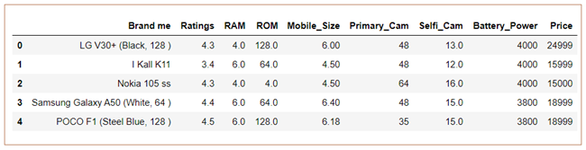
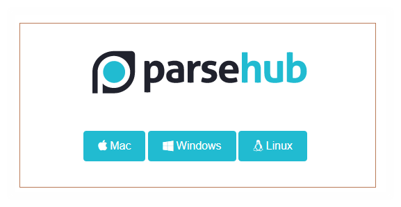
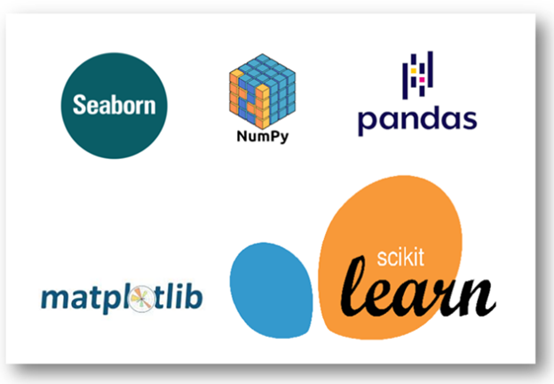
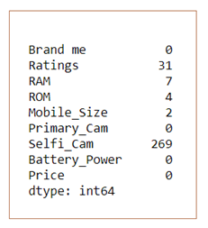
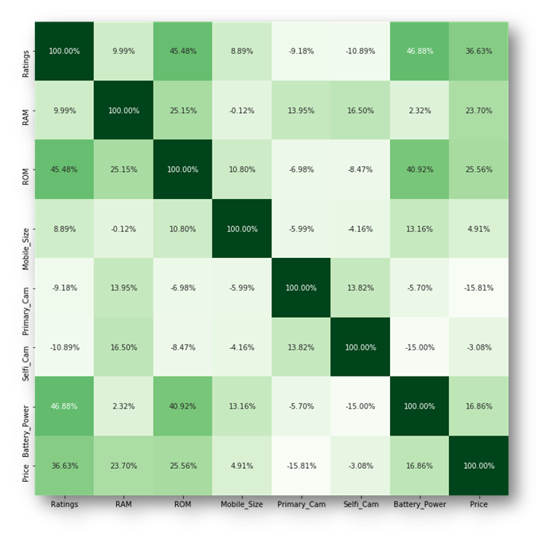
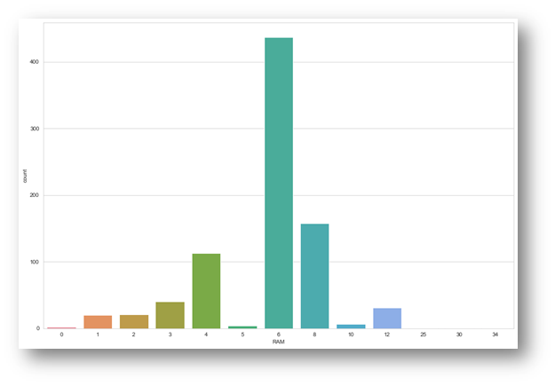
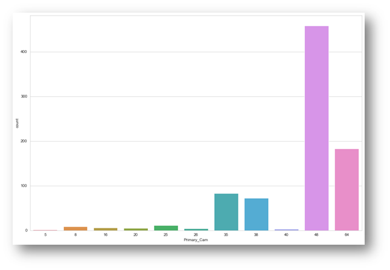
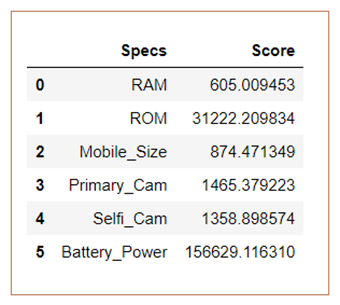
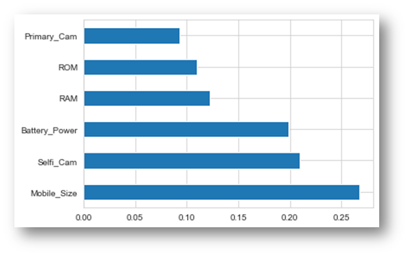

# Mobile Price Prediction Using Machine Learning #
## Table of Content ##
- [Overview](#overview) 
- [Motivation](#motivation) 
- [Installation](#installation)
- [Understand the Problem Statement](#understand-the-problem-statement) 
- [About the Data](#about-the-data) 
- [About the Web Scrapping](#about-the-web-scrapping) 
- [Algorithms and Technologies Used](#algorithms-and-technologies-used) 
- [Packages Used](#packages-used)
- [Data Collection](#data-collection)
- [Data Preprocessing](#data-preprocessing) 
- [Exploratory Data Analysis](#exploratory-data-analysis) 
- [About Data Features](#about-data-features)
- [Model Fitting](#model-fitting) 
- [Accuracy and Prediction Score](#accuracy-and-prediction-score)
- [Team](#team) 

## Overview 
We are going to do implementing a salable model for predicting the mobile price prediction using some of the regression techniques based of some of features in the dataset which is called mobile Price Prediction. There are some of the processing techniques for creating a model. In this project i used web scrapping techniques for collecting the mobile data from E-Commerce website. We will see about it in upcoming parts.

## Motivation 
The Motivation behind it I just wanna know about the various kinds of mobile prices during the lock down period. Because now a days most of the E-Commerce website are focusing to sell the mobile for consumers.

Because now a days many of the students including me also having the online class rooms for continue our education systems. So I got the idea about to do some of the useful things do in the lock down period. That’s why I decided to doing in this project. As well as one of my brother asked to me “Bro why shouldn’t we do this mobile price prediction from end to end? Like we are not going to do get the data from Kaggle for this project” .So I decided to make in this way.

## Installation 
The Code is written in Python 3.7. If you don't have Python installed just [clik here](https://www.python.org/downloads/) and install python on your system. 
If you are using a lower version of Python you can upgrade using the pip package, ensuring you have the latest version of pip. To install the required packages and libraries, such as numpy, pandas, matplotlib and sklearn.

## Understand the Problem Statement
Mobile prices are an important reflection of the Humans and some ranges are of great interest for both buyers and sellers. Ask a mobile buyer to describe their dream Mobile or Branded Mobile Phones. So in this blog we are going to see about how the prices are segregated based on the some of the features. As well as the target feature prediction based on the same features.

## About the Data 
In this dataset I wasn’t downloading from Kaggle or any other data collecting websites. I just make or create the dataset using one of the web scrapping tools. I’ll tell about next upcoming part. So a little bit of overview we understand about the data and its features.

``` bash
# lets understand features of this dataset
df.columns
Index([‘Brand me’, ‘Ratings’, ‘RAM’, ‘ROM’, ‘Mobile_Size’, ‘Primary_Cam’,
‘Selfi_Cam’, ‘Battery_Power’, ‘Price’],
dtype=’object’)

```

## Data Overview



* Brand me — This is first feature of our dataset. Its Denotes name of the mobile phones and Brands.
* Ratings — This Feature Denotes Number of the ratings gave by the consumers for each mobile.
* RAM — It’s have RAM size of the phone.
* ROM — It’s have ROM (Internal Memory) size of the phone.
* Mobile_Size — It’s represents how many inches of the particular mobile phone have. Here all the values are gave in inches
* Primary_Cam — It’s Denotes Number of the pixels of the primary camera (Back Camera) for each mobile.
* Selfi_Cam — It’s Denotes Number of the pixels of the Selfi camera (Front Camera) for each mobile.
* Battery_Power — It’s Denotes amount of the battery power in each mobiles in mAh.
* Price — It’s a Dependent Feature of the dataset. It’s just denoting prices of the each mobile.

## About the Web Scrapping

In this project I wasn’t get the dataset from Kaggle rather than I got an idea about download from mobile websites. So I decided using web scrapping method. So we should understand one thing what is web scrapping? Web scraping, web harvesting, or web data extraction is data scraping used for extracting data from websites.
Web scraping software may access the World Wide Web directly using the Hypertext Transfer Protocol, or through a web browser.




## Algorithms and Technologies Used 

The major aim of in this project is to predict the house prices based on the features using some of the regression techniques and algorithms.
**1. Random Forest Regressor **
**2. Support Vector Regressor **

## Packages Used 

[](https://www.python.org/)

## Data Collection 

Here if you search the dataset in Kaggle you won’t be get the same dataset from Kaggle. But you’ll be getting another kind of datasets like that. So Data collection part I already mentioned to you using web scrapping method to collecting the data from one of the E-Commerce website in Mobile sections. So here I’d like mentioned the link for you’ll be getting the data. If you wanna get the dataset just [click here](https://github.com/Nivitus/Machine-Learning-Projects/tree/master/Mobile%20Price%20Prediction/Data)

## Data Preprocessing

Data preprocessing is an important step in the data mining process. The phrase “garbage in, garbage out” is particularly applicable to data mining and machine learning projects. Data-gathering methods are often loosely controlled, resulting in out-of-range values, impossible data combinations, missing values, etc.
In this project you might be performing lot of preprocessing steps. Because in this dataset is not downloaded from Kaggle or any other data source website. This data retrieve from E-Commerce website. But after I was get the dataset I was make a dataset for model prediction. So you need not to and data preprocessing steps except handling the missing values.

``` bash
# Shape of the Dataset
print(“Shape of Training dataset:”, df.shape)
Shape of Training dataset: (836, 9)
# Checking null values for training dataset
df.isnull().sum()

```



## Exploratory Data Analysis 
In statistics, exploratory data analysis (EDA) is an approach to analyzing data sets to summarize their main characteristics, often with visual methods. A statistical model can be used or not, but primarily EDA is for seeing what the data can tell us beyond the formal modeling or hypothesis testing task.

First Understanding the correlation of features between target and other features 
``` bash 
# Plotting the heatmap of correlation between features
plt.figure(figsize=(14,14))
sns.heatmap(corr, cbar=False, square= True, fmt=’.2%’, annot=True, cmap=’Greens’)
```


### RAM Frequency  
``` bash
plt.figure(figsize=(15,10))
sns.set_style(‘whitegrid’)
sns.countplot(x=’RAM’,data=df)
```


### Primary Camera Frequency  
``` bash
plt.figure(figsize=(15,10))
sns.set_style(‘whitegrid’)
sns.countplot(x=’Primary_Cam’,data=df)
```


## About Data Features

Feature Selection is the process where you automatically or manually select those features which contribute most to your prediction variable or output in which you are interested in. Having irrelevant features in your data can decrease the accuracy of the models and make your model learn based on irrelevant features.

``` bash
# Fitting Method
dfscores = pd.DataFrame(fit.scores_)
dfcolumns = pd.DataFrame(X.columns)
# Concat two dataframes for better visualization
featureScores = pd.concat([dfcolumns,dfscores],axis=1)
featureScores.columns = [‘Specs’,’Score’] #naming the dataframe columns
featureScores
```





## Model Fitting 
### Random Forest 

``` python

# TODO: Assigning the values for model fitting

X = df.iloc[:,[6,2,4,5,1,3]]
y = df.iloc[:,[-1]]
```python

# TODO: Train Test Split and Build and Train the model

Since our process involves training and testing, we should split our dataset. It can be executed by the following code.

from sklearn.model_selection import train_test_split
X_train,X_test,y_train,y_test = train_test_split(X,y,test_size=0.25,random_state=15)
```
``` python
TODO: Using Random Forest Regressor
from sklearn.ensemble import RandomForestRegressor
reg = RandomForestRegressor()
reg.fit(X_train,y_train)
```
``` python
TODO: Prediciting
y_pred = reg.predict(X_train)
```

### Support Vector Machine

``` python
# TODO: Train Test Split and Build and Train the model
from sklearn.model_selection import train_test_split
X_train,X_test,y_train,y_test = train_test_split(X,y,test_size=0.25,random_state=15)
```

``` python
from sklearn.svm import SVR
regressor = SVR(kernel = 'rbf')
regressor.fit(X, y)
```

``` bash
TODO: Predict using SVM
y_pred = reg.predict(X_train)
```

## Accuracy and Prediction Score 
### Random Forest

``` python
# Training Score
print("Training Accuracy:",reg.score(X_train,y_train)*100)
Training Accuracy: 96.2779244902184
```
``` python
# Testing Score
print("Testing Accuracy:",reg.score(X_test,y_test)*100)
Testing Accuracy: 95.33388099982595
```
### Random Forest Regressor
#### Tarining Accuracy: 96.2% Accuracy
#### Testing Accuracy: 95.3% Accuracy
### Support Vector Regressor
#### Tarining Accuracy: 96.2% Accuracy
#### Testing Accuracy: 95.8% Accuracy

## Team


